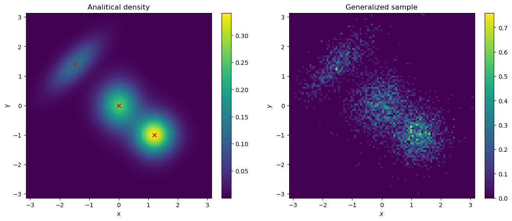

## lmcmc-project

This is a realisation of the Tempered Transition MCMC algorithm in Python.

Classical MCMC, HMC or NUTS algorithms have convergence problems when we are talking about complicated multimodal distributions. Hoffman and Gelman in [Conceptual Introduction to HMC](https://arxiv.org/pdf/1701.02434) show that all Monte-Carlo based algorithms have the local nature of convergence, but at the same time they are very effective for hard-scaled tasks.

The Tempered Transition algorithm can solve multimodal problems.

This project is based on the [Little MCMC library](https://github.com/eigenfoo/littlemcmc) — a lightweight Python framework for building custom MCMC samplers. For more details on the library's architecture and capabilities, see the [Little MCMC article](https://github.com/eigenfoo/littlemcmc#citation) (official documentation and citation info).

## Results

In `temtra/energy.py` script you can see some realisations of test-functions for TT HMC sampling. One of the most representative is the von Mises distribution. This is a complex periodic multimodal distribution with very high curvature. In the picture you can see results of four independent sampling runs of this distribution and the convergence graphic.

## Links

- [Little MCMC Library](https://github.com/eigenfoo/littlemcmc)
- [Conceptual Introduction to HMC by Hoffman & Gelman](https://arxiv.org/pdf/1701.02434)
